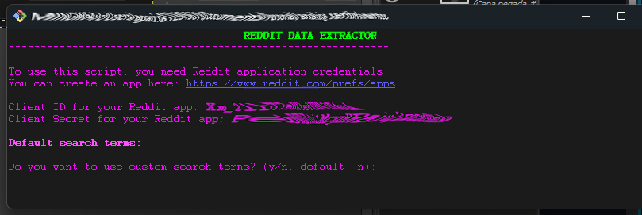
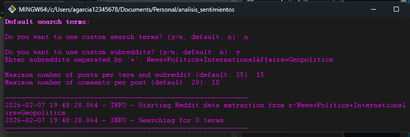
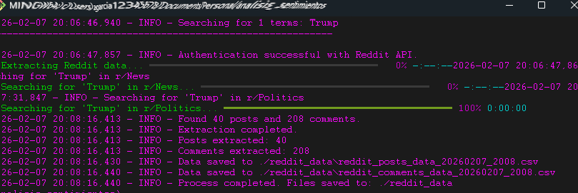

# Reddit Data Extractor and Sentiment Analysis Project

This project provides a Python-based tool to extract posts and comments from Reddit based on user-defined search terms and subreddits. The extracted data includes various objective metrics about posts and comments and is saved into CSV files for further analysis. While initially designed for analyzing sentiments related to trade and tariffs, the tool is flexible enough to extract data on any topic.

## Current Functionality

The project currently consists of two main Python scripts:

### `main.py`
This file currently serves as a placeholder. When executed, it simply prints a welcome message:
```
Hello from analisis-sentimientos!
```
The primary execution logic for data extraction resides in `reddit_api_v2.py`.

### `reddit_api_v2.py`
This script is the core of the data extraction process. It handles authentication with the Reddit API and fetches posts and comments.

**Key Features:**
-   **Reddit API Authentication:** Uses OAuth2 to securely authenticate with Reddit using a Client ID and Client Secret.
-   **Configurable Search:** Allows users to specify multiple search terms and target specific subreddits (or search across all Reddit).
-   **Data Extraction:** Retrieves comprehensive data for Reddit posts (title, text, score, upvote ratio, creation time, number of comments, permalink, subreddit, author, etc.) and their associated comments (text, score, creation time, author, permalink, etc.).
-   **Objective Metrics:** Extracts various objective metrics for both posts and comments, such as text length, word count, upvote ratio, score, and controversiality, without performing subjective analysis.
-   **Text Cleaning:** Includes a utility function to clean extracted text by removing URLs and Reddit-specific formatting characters.
-   **Google Drive Integration (Optional):** Designed to integrate with Google Drive (particularly useful in Google Colab environments) to automatically save extracted CSV files to a specified path. Falls back to a local directory if Google Drive is not available or cannot be mounted.
-   **User-Friendly Input:** Prompts the user for necessary credentials, search parameters, and data limits via a command-line interface, offering default values and guidance.
-   **CSV Export:** Saves the extracted posts and comments into separate CSV files, timestamped for easy organization.

**How to Run `reddit_api_v2.py`:**

1.  **Prerequisites:**
    *   Python 3.x installed.
    *   **uv** package manager installed (`pip install uv`).
    *   Install required Python packages using `uv`:
        ```bash
        uv pip install -r requirements.txt
        # Or, to install based on pyproject.toml
        uv sync
        ```
        (Note: While `praw` is listed in `requirements.txt`, this script directly uses `requests` for API interactions. `uv sync` will install dependencies defined in `pyproject.toml` and `uv.lock`.)
2.  **Reddit API Credentials:**
    *   You need a Reddit application's Client ID and Client Secret. Follow these steps to obtain them:
        1.  Go to [https://www.reddit.com/prefs/apps](https://www.reddit.com/prefs/apps).
        2.  Scroll down and click on "create another app...".
        3.  Select "script" as the application type.
        4.  Fill in the "name" (e.g., "SentimentAnalysisTool"), "description", and set "redirect uri" to `http://localhost:8080` (or any valid URL, it's not used for this script type but is required).
        5.  Click "create app".
        6.  Your Client ID will be shown below the app name. Your Client Secret will be next to the "secret" label.
3.  **Execution:**
    *   Run the script from your terminal:
        ```bash
        python reddit_api_v2.py
        ```
    *   The script will then guide you through providing the Client ID, Client Secret, search terms, subreddits, and limits.
    *   Upon completion, CSV files containing the extracted posts and comments will be saved in the specified output directory (either Google Drive or a local `reddit_data` folder).

## Future Enhancements
This project is continuously evolving. Planned enhancements include:
- Removing emojis from print statements for a cleaner CLI output.
- Implementing advanced logging features for better traceability and debugging.
- Integrating modern CLI display libraries (e.g., progress bars, animations) for an improved user experience, especially in environments like Git Bash.
- Ensuring full script functionality and robustness.
- Developing comprehensive sentiment analysis capabilities using the extracted data.
- Improving error handling and user feedback.
=======
## Reddit Data Scraper

This project is a handy tool built to pull data from Reddit about pretty much any topic you can think of. Instead of using a big library like PRAW, it talks directly to Reddit's API using simple HTTP requests, which keeps things lightweight and easy to understand.

I made this for anyone who wants to see what people are saying on Reddit—whether you're a researcher, a student, or just curious about public opinion. You can use the data you gather for all sorts of cool things, like finding out what people think about a new movie, tracking trends, or analyzing discussions on any subject.



---

## How It Works Under the Hood

At its core, this is a Python script that handles everything from start to finish. It logs into the Reddit API for you, searches for posts on topics you're interested in across different communities (subreddits), and neatly saves the posts and their comments.

### Cool Features

* ***Goes Straight to the Source***: It uses the `requests` library to talk directly with the Reddit API, so there are no extra layers to worry about.
* ***Secure Login***: It uses the official OAuth2 method to connect securely to your Reddit account.
* ***You're in Control***: You can search for any keywords you want and tell it exactly which subreddits to look in.
* ***Cleans Up the Data for You***: It has a built-in function that tidies up the text by removing links, weird characters, and Reddit formatting. This makes the data much easier to work with later on.
* ***Neatly Organized Output***: It saves everything into two clean CSV files (one for posts, one for comments) that you can easily open in Excel or use for data analysis.
* ***Works Great with Google Colab***: If you like working in the cloud, the script is set up to run smoothly in Google Colab and can save your data directly to your Google Drive.
* ***Easy to Get Started***: A simple command-line interface walks you through the setup, asking for your login info and what you want to search for.


### Why You Might Find This Useful

This little bot is pretty valuable for a few reasons:

1.  **No Extra Baggage**: Since it doesn't depend on other big libraries, it's less likely to break if they change, and you get a clearer picture of how the API works.
2.  **Flexible and Expandable**: You can easily change the search terms and subreddits to fit your needs. Want to find out what people think about pineapple on pizza? Go for it.
3.  **Great for Projects**: The clean, structured data is perfect for any project where you need real conversations, whether it's for school, work, or just for fun.
4.  **A Starting Point for Deeper Analysis**: The data you collect is perfect for things like:
    * **Sentiment Analysis**: Find out if the general vibe on a topic is positive or negative.
    * **Topic Modeling**: Discover the main themes people are talking about.
    * **Trend Spotting**: See how conversations on a topic change over time.

---

## Getting Started

Ready to give it a try? You'll just need Python 3.6 or higher.

### What You'll Need

* **Python 3.6+**
* **A couple of Python libraries**: `requests` and `pandas`
* **Reddit API Credentials**: You'll need a `Client ID` and a `Client Secret`. Don't worry, getting them is easy!

### How to Get Your Reddit Credentials

1.  Go to the **[Reddit apps page](https://www.reddit.com/prefs/apps)**.
2.  Scroll to the bottom and click on the button that says ***"are you a developer? create an app..."***.
3.  Fill out the form:
    * **Name**: Give it a fun name, like *MyRedditScraper*.
    * **Type**: Choose ***script***.
    * **Description**: Anything you want!
    * **About URL**: You can leave this empty.
    * **Redirect URI**: Just put `http://localhost:8080`.
4.  Click ***"create app,"*** and you're done! You'll now have a **Client ID** and a **Client Secret**.

### How to Use the Scraper

1.  Download or clone the project files.
2.  Install the libraries you'll need:
    ```bash
    pip install requests pandas
    ```
3.  Run the script from your terminal:
    ```bash
    python reddit_data_extractor.py
    ```
4.  The script will guide you through the rest!



---

## What the Data Looks Like

You'll get two CSV files, one for posts and one for comments. Here’s what’s inside:

### Posts Data (`reddit_posts_*.csv`)

| Field          | Description                                                    |
| :------------- | :------------------------------------------------------------- |
| **post\_id** | A unique ID for each post.                                     |
| **title** | The title of the post.                                         |
| **text** | The body text of the post.                                     |
| **score** | The post's score (upvotes minus downvotes).                    |
| **upvote\_ratio**| The percentage of upvotes.                                     |
| **created\_utc** | When the post was created.                                     |
| **num\_comments** | How many comments it has.                                      |
| **permalink** | A direct link to the post.                                     |
| **subreddit** | The community it was posted in.                                |
| **author** | Who posted it.                                                 |
| **search\_term** | The keyword you used to find this post.                        |
| **title\_clean** | The title, but all cleaned up for analysis.                    |
| **text\_clean** | The body text, also cleaned up.                                |

### Comments Data (`reddit_comments_*.csv`)

| Field           | Description                                                 |
| :-------------- | :---------------------------------------------------------- |
| **comment\_id** | A unique ID I made for each comment.                        |
| **post\_id** | The ID of the post the comment belongs to.                  |
| **text** | What the comment says.                                      |
| **score** | The comment's score.                                        |
| **created\_utc** | When the comment was posted.                                |
| **author** | Who wrote it.                                               |
| **is\_submitter** | A true/false value for whether this person also wrote the post. |
| **permalink** | A direct link to the comment.                               |
| **text\_clean** | The comment text, all cleaned up.                           |

---

## A Few Things to Keep in Mind

* **Be Nice to Reddit's API**: Reddit allows about 60 requests per minute. I've already added some pauses in the script so it doesn't go too fast and get blocked.
* **It's a Search Tool**: This tool finds posts based on your keywords. It isn't designed to download *every single post* from a subreddit, but rather the ones that are most relevant to what you're looking for.

***

<br>

# Extractor de Datos de Reddit

¡Hola! Este proyecto es una herramienta que creé para extraer datos de Reddit sobre prácticamente cualquier tema que se te ocurra. En lugar de usar una librería grande como PRAW, se comunica directamente con la API de Reddit mediante peticiones HTTP, lo que lo hace más ligero y fácil de entender.

Hice esto para cualquiera que quiera saber qué dice la gente en Reddit, ya seas un investigador, un estudiante o simplemente alguien con curiosidad sobre la opinión pública. Puedes usar los datos que recopiles para todo tipo de cosas geniales, como ver qué opina la gente de una película nueva, seguir tendencias o analizar debates sobre cualquier tema.

---

## ¿Cómo Funciona por Debajo?

Básicamente, es un script de Python que se encarga de todo. Inicia sesión en la API de Reddit, busca publicaciones sobre los temas que te interesan en diferentes comunidades (subreddits) y guarda de forma ordenada tanto las publicaciones como sus comentarios.

### Funcionalidades Geniales

* ***Directo a la Fuente***: Usa la librería `requests` para hablar directamente con la API de Reddit, así que no hay intermediarios de los que preocuparse.
* ***Inicio de Sesión Seguro***: Utiliza el método oficial OAuth2 para conectarse de forma segura a tu cuenta de Reddit.
* ***Tú Tienes el Control***: Puedes buscar las palabras clave que quieras e indicarle exactamente en qué subreddits buscar.
* ***Limpia los Datos por Ti***: Incluye una función que ordena el texto, eliminando enlaces, caracteres extraños y formatos de Reddit. Esto hace que los datos sean mucho más fáciles de analizar después.
* ***Resultados Bien Organizados***: Guarda todo en dos archivos CSV (uno para publicaciones y otro para comentarios), listos para abrir en Excel o usar en tus análisis.
* ***Funciona de Maravilla con Google Colab***: Si te gusta trabajar en la nube, el script está preparado para funcionar sin problemas en Google Colab y puede guardar los datos directamente en tu Google Drive.
* ***Fácil de Empezar***: Una sencilla interfaz de terminal te guía paso a paso, pidiéndote tus credenciales y lo que quieres buscar.

### ¿Por Qué Podría Serte Útil?

Este pequeño bot es bastante valioso por varias razones:

1.  **Sin Complicaciones**: Como no depende de otras librerías grandes, es menos probable que se rompa con actualizaciones, y te da una idea más clara de cómo funciona la API.
2.  **Flexible y Ampliable**: Puedes cambiar fácilmente los términos de búsqueda y los subreddits para adaptarlos a lo que necesites. ¿Quieres saber qué opina la gente sobre la pizza con piña? ¡Adelante!
3.  **Perfecto para Proyectos**: Los datos limpios y estructurados son ideales para cualquier proyecto en el que necesites conversaciones reales, ya sea para la universidad, el trabajo o por pura diversión.
4.  **Un Punto de Partida para Análisis Más Profundos**: Los datos que recopilas son perfectos para cosas como:
    * **Análisis de Sentimientos**: Descubre si el ambiente general sobre un tema es positivo o negativo.
    * **Modelado de Tópicos**: Identifica los principales temas de los que habla la gente.
    * **Detección de Tendencias**: Observa cómo cambian las conversaciones sobre un tema a lo largo del tiempo.

---

## ¡A Empezar!

¿Listo para probarlo? Solo necesitas Python 3.6 o una versión más reciente.

### Lo que Necesitarás

* **Python 3.6+**
* **Un par de librerías de Python**: `requests` y `pandas`
* **Credenciales de la API de Reddit**: Necesitarás un `Client ID` y un `Client Secret`. ¡No te preocupes, es fácil conseguirlos!

### Cómo Obtener tus Credenciales de Reddit

1.  Ve a la **[página de aplicaciones de Reddit](https://www.reddit.com/prefs/apps)**.
2.  Baja hasta el final y haz clic en el botón que dice ***"are you a developer? create an app..."***.
3.  Rellena el formulario:
    * **Name**: Ponle un nombre divertido, como *MiExtractorDeReddit*.
    * **Type**: Elige ***script***.
    * **Description**: ¡Lo que quieras!
    * **About URL**: Puedes dejarlo en blanco.
    * **Redirect URI**: Simplemente pon `http://localhost:8080`.
4.  Haz clic en ***"create app"***, ¡y listo! Ahora tendrás un **Client ID** y un **Client Secret**.

### Cómo Usar el Extractor

#### En Google Colab (La Forma Fácil)

1.  Abre el archivo de notebook del script en Google Colab.
2.  Simplemente ejecuta las celdas en orden.
3.  Te pedirá tu `Client ID` y `Client Secret`.
4.  Puedes introducir tus propios términos de búsqueda y subreddits o usar los que vienen por defecto.
5.  Se conectará a tu Google Drive y guardará los archivos allí.

#### En Tu Propio Ordenador

1.  Descarga o clona los archivos del proyecto.
2.  Instala las librerías que necesitarás:
    ```bash
    pip install requests pandas
    ```
3.  Ejecuta el script desde tu terminal:
    ```bash
    python extractor_de_datos_reddit.py
    ```
4.  ¡El script te guiará por el resto del proceso!

---

## ¿Qué Aspecto Tienen los Datos?

Obtendrás dos archivos CSV, uno para publicaciones y otro para comentarios. Esto es lo que contienen:

### Datos de Publicaciones (`reddit_posts_*.csv`)

| Campo          | Descripción                                                    |
| :------------- | :------------------------------------------------------------- |
| **post\_id** | Un ID único para cada publicación.                             |
| **title** | El título de la publicación.                                   |
| **text** | El texto del cuerpo de la publicación.                         |
| **score** | La puntuación de la publicación (votos a favor menos votos en contra). |
| **upvote\_ratio**| El porcentaje de votos a favor.                                |
| **created\_utc** | Cuándo se creó la publicación.                                 |
| **num\_comments** | Cuántos comentarios tiene.                                     |
| **permalink** | Un enlace directo a la publicación.                            |
| **subreddit** | La comunidad en la que se publicó.                             |
| **author** | Quién la publicó.                                              |
| **search\_term** | La palabra clave que usaste para encontrar esta publicación.   |
| **title\_clean** | El título, pero ya limpio para el análisis.                    |
| **text\_clean** | El texto del cuerpo, también limpio.                           |

### Datos de Comentarios (`reddit_comments_*.csv`)

| Campo           | Descripción                                                 |
| :-------------- | :---------------------------------------------------------- |
| **comment\_id** | Un ID único que creé para cada comentario.                  |
| **post\_id** | El ID de la publicación a la que pertenece el comentario.   |
| **text** | Lo que dice el comentario.                                  |
| **score** | La puntuación del comentario.                               |
| **created\_utc** | Cuándo se publicó el comentario.                            |
| **author** | Quién lo escribió.                                          |
| **is\_submitter** | Un valor verdadero/falso que indica si esta persona también escribió la publicación. |
| **permalink** | Un enlace directo al comentario.                            |
| **text\_clean** | El texto del comentario, ya limpio.                         |

---

## Un Par de Cosas a Tener en Cuenta

* **Sé Amable con la API de Reddit**: Reddit permite unas 60 peticiones por minuto. Ya he añadido algunas pausas en el script para que no vaya demasiado rápido y te bloqueen.
* **Es una Herramienta de Búsqueda**: Esta herramienta encuentra publicaciones basadas en tus palabras clave. No está diseñada para descargar *todas y cada una de las publicaciones* de un subreddit, sino las que son más relevantes para lo que buscas
